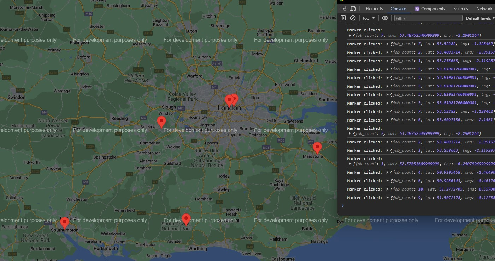

- NB : all azure resources deleted to stop charges incurring - see 'Azureresources.csv'
- NB : this will render the app unexecutable but the microesrvices have been built with reproducability in mind 
-    : though a full resource group creation and resource(s) allocation may be necessary...

# Here is a sample of the final webmap output:

This gives us an immediate visual insights into where each of the jobs are located, and other aggregative information i.e., total number of jobs at x, y. 
To understand how the raw data was collected and serviced for this application, refer to: https://github.com/sandip623/jeograph-webscrape 

----------------------------------------------------------------------------------------------------------------------------------------------
----------------------------------------------------------------------------------------------------------------------------------------------
----------------------------------------------------------------------------------------------------------------------------------------------
Extra developer notes (can be ignored for readers):
.env configuration hidden

- consider a surrogate key

- consider storing api keys i.e., for gmaps in a cloud vault

- pyodbc library for db connectivity

react js, flask = client (UI), server (data processor)

- configure cors (flask_cors was used)

- npm install google-maps-react 

gcp project - geographgeocodeapikey

- since backend/frontend are separate components - must setup containers separately

- replace flask builtin-wsgi with gunicorn wsgi in Docker config for enabling container-external access to app.

- separate odbc driver installation need to be specified in flask server Dockerfile as a dependency
( https://gist.github.com/joshatxantie/4bcf5d0243fba63845fce7cc40365a3a )

# deploy containerized app on azure with Azure App Service 
(https://learn.microsoft.com/en-us/training/modules/deploy-run-container-app-service/1-introduction)
- configure Azure Container Registry 
az-bash commands: 
-- create container registry
$ az acr create --name jeocontainerregistry --resource-group dev-jeograph --sku standard --admin-enabled true
-- can use acr to build images
$ az acr build --file Dockerfile --registry <myregistry> --image <myimage> .

========================== OPEN LOOP ======================================
REPEAT THE FOLLOWING PROCESS FOR ALL RELEVANT IMAGES:
-- from the acr overview page -> access keys -> contains login credentials, now we can run following in cmd
cmd: docker login jeocontainerregistry.azurecr.io
-- push image to container registry
 -- tag the image being uploaded into registry
      cmd: docker tag <local_image_name> <acr_name>.azurecr.io/<image_name>:<tag>
i.e., cmd: docker tag jeograph-flask-server jeocontainerregistry.azurecr.io/jeograph-flask-server:jeoacrepo
 -- push the image
      docker push <acr_name>.azurecr.io/<image_name>:<tag>
      i.e., cmd: docker push jeocontainerregistry.azurecr.io/jeograph-flask-server:jeoacrepo
=========================== CLOSE LOOP ====================================

-- azure web app service: jeographwebapp.azurewebsites.net    [ docker container ] | [ multi-container ] | [ docker-compose.yaml file needed ]
--                                                                                                         [ docker compose file defines services that make up the application (i.e., microservices)]
--                        jeographmultiservice.azurewebsites.net
-- once deployed test via resource overview page...

# note - ensure react frontend fetch requests are pointing to flask-server in azure endpoint

-- also good practice to handle default routing in react frontend component.
